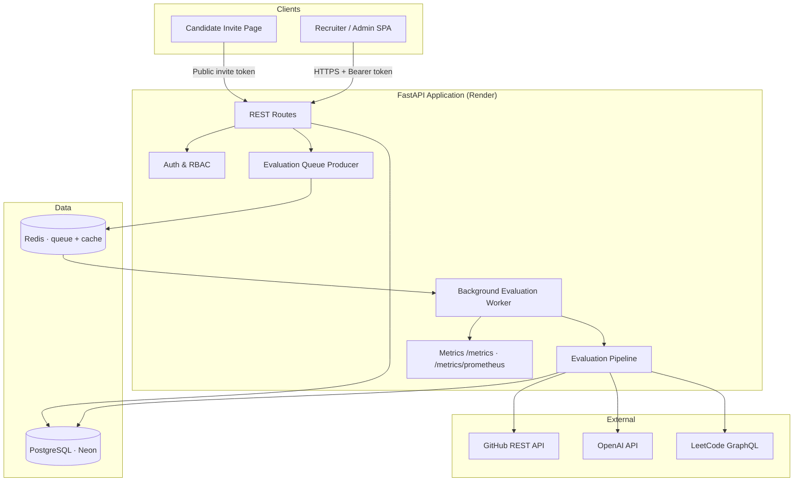
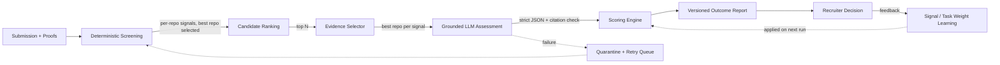
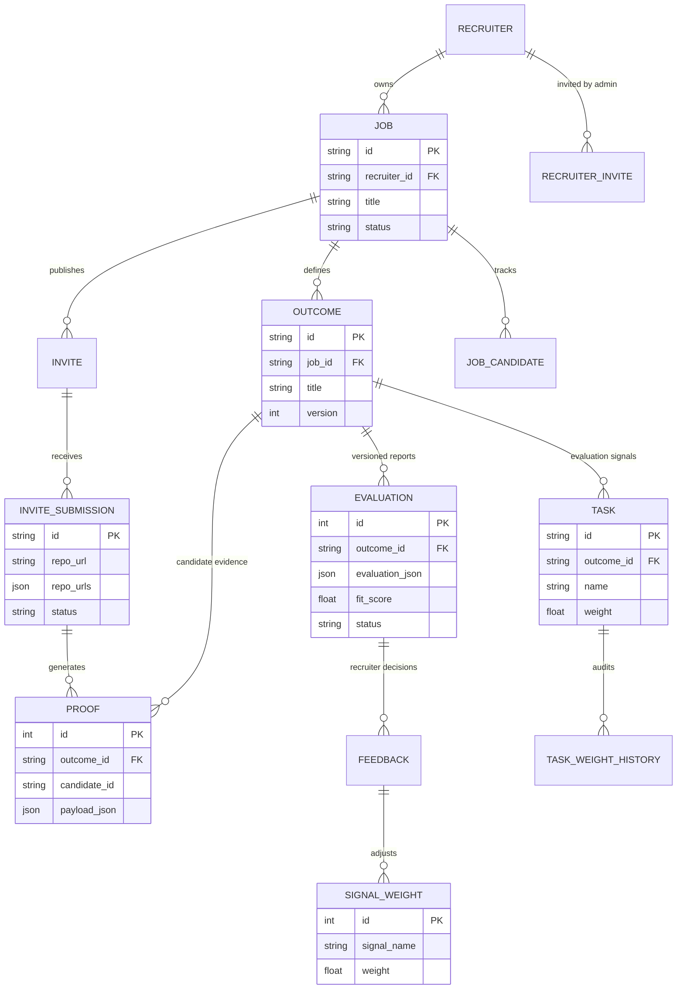
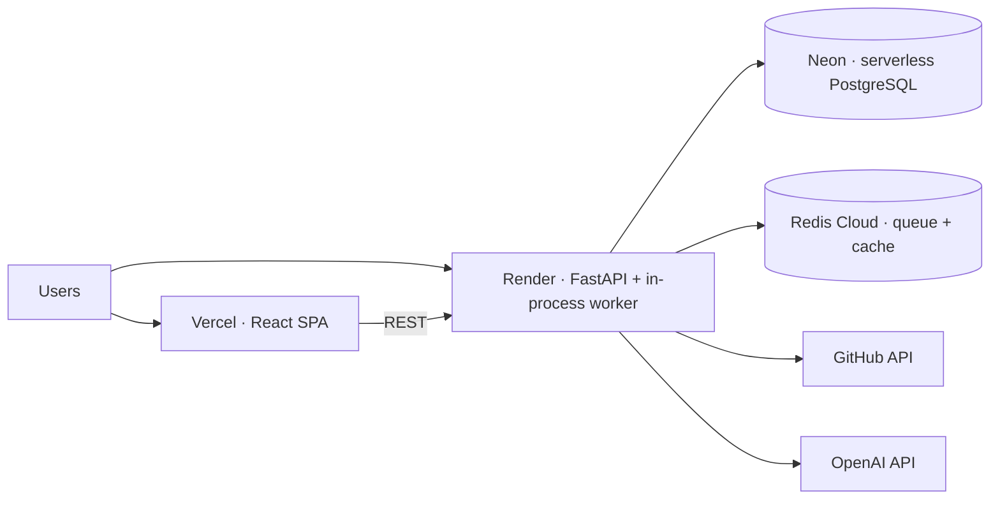

# SignalStack

**Proof-of-work hiring infrastructure for technical teams.**

SignalStack replaces resume guessing with evidence-backed technical evaluation. It decomposes a job into measurable outcomes, collects candidate repositories and artifacts, analyzes real code, and produces auditable hiring reports in which every score traces back to inspectable proof.

| | |
| --- | --- |
| **Domain** | AI-assisted technical hiring / candidate evaluation |
| **Backend** | FastAPI · SQLAlchemy · PostgreSQL (Neon) · Redis |
| **Frontend** | React 18 · Vite · Tailwind CSS |
| **AI** | OpenAI Responses API with strict structured outputs |
| **Deployment** | Render (API) · Vercel (SPA) · Neon (DB) · Redis Cloud |

---

## System Design

### Architecture Overview



### Evaluation Pipeline Components



Key design decisions:

- **Multi-repo evidence routing** — candidates submit up to 3 repositories; each outcome signal is evaluated against the repository with the strongest evidence for it.
- **Deterministic-first, LLM-second** — every candidate gets a zero-cost deterministic screen; only top candidates receive LLM deep evaluation.
- **Separated score dimensions** — capability, evidence confidence, production readiness, and authorship verification are independent, so one weak dimension never silently poisons another.
- **Learning loop** — recruiter decisions adjust signal/task weights (bounded, audited, revertible) that feed back into future scoring.

### Evaluation Reliability Model

Evaluations are fault-tolerant by design. The system applies a **validated-write / merge-preserve** pattern:

| Guarantee | Mechanism |
| --- | --- |
| No fake scores | LLM failures return an explicit `llm_failed` marker — never a silent `0.0`. |
| All-or-nothing per candidate | A candidate with any failed interpretation is **quarantined**: removed from summaries, task rankings, and recommendations for that run. |
| Previous results preserved | Reports are **append-only versions**; a new version is written only when it contains at least one successful result. A failed run never replaces the last valid report. |
| Safe retries | Quarantined candidates are flipped back to a retryable state; the incremental merge re-evaluates only missing candidates, making retries **idempotent**. |
| No duplicate work | Enqueueing is idempotent — one pending evaluation task per job; repeated "Evaluate" clicks return the existing task. |
| Crash recovery | Tasks stuck in `processing` are recovered to pending on worker start; stale `evaluating` rows are re-queued; progress polling can revive the worker after a platform restart. |

### Data Model



### Deployment Architecture



- **Stateless API** — all durable state lives in PostgreSQL and Redis, so Render instances can restart or scale without data loss.
- **Schema management** — Alembic migrations (`backend/alembic/`) are the source of truth; a narrow runtime schema guard self-heals recently added columns at startup so deploys never race migrations.
- **Queue durability** — evaluation tasks live in Redis and survive process restarts; the in-memory queue is a development fallback.

---

## Technology Stack

| Layer | Technology | Notes |
| --- | --- | --- |
| API | FastAPI, Pydantic v2 | Typed request/response schemas, OpenAPI docs at `/docs` |
| ORM / DB | SQLAlchemy 2, PostgreSQL, Alembic | SQLite fallback for local development |
| Queue / cache | Redis | Job evaluation queue, GitHub + LLM response cache |
| AI | OpenAI Responses API | Strict JSON-schema outputs, model routing (eval vs fast model), retries with jittered backoff, per-model cost tracking |
| Auth | PBKDF2-SHA256, signed bearer tokens | Invite-only recruiter signup, admin bootstrap |
| Frontend | React 18, Vite, Tailwind CSS, Recharts, Lucide | Design tokens in `index.css` + `tailwind.config.js` |
| Observability | JSON + Prometheus metrics | Latency histograms, token/cost counters, cache hit rates |

## Folder Structure

```text
backend/
  app/
    config/       Runtime config and database session management
    constants/    Shared category definitions
    models/       SQLAlchemy models
    pipeline/     Evaluator, evidence selector, signal extractor, scoring engine,
                  identity verifier, feedback learning
    routes/       FastAPI route handlers
    schemas/      Pydantic request/response schemas
    services/     LLM, GitHub, LeetCode, Redis queue/cache, auth, CRUD
    utils/        Shared helpers
  alembic/        Database migrations
  tests/          Unit and integration tests
frontend/
  src/
    components/   Shared UI (layout, evidence cards, modals, charts)
    pages/        Route-level views
    api.js        API client
    index.css     Design system tokens and component classes
```

## API Overview

| Area | Endpoints |
| --- | --- |
| Auth | `POST /recruiter/login`, `POST /recruiter/signup`, `GET /recruiter/me` |
| Jobs | `POST/GET/PATCH/DELETE /jobs…` |
| Outcomes & signals | `POST /outcomes`, `PATCH/DELETE /outcomes/{id}`, `POST /plugin/suggest-tasks` |
| Candidate intake | `POST /jobs/{id}/invites`, `GET /invites/{token}`, `POST /invites/{token}/submit` (supports `repo_urls`, max 3) |
| Evaluation | `POST /jobs/{id}/evaluations/queue`, `GET /jobs/{id}/evaluations/progress`, `GET /plugin/status/{outcome_id}` |
| Learning | `POST /plugin/feedback`, `POST /feedback/task-weight`, `PUT /feedback/reset/{job_id}` |
| Admin | `GET /admin/signal-weights`, `/admin/audit-logs`, `/admin/llm-logs`, `/admin/task-weight-history` |
| Ops | `GET /metrics`, `GET /metrics/prometheus` |

## Error Handling Strategy

- **External calls** (GitHub, OpenAI, LeetCode): retried with exponential backoff + jitter on transient failures (timeouts, connection resets, 429, 5xx); GitHub falls back to unauthenticated access on token failure.
- **LLM failures**: explicitly marked, quarantined per candidate, never persisted as scores (see Reliability Model above).
- **Background tasks**: failures mark the affected submission/candidate `failed` with an audit trail; the standard queue flow retries them.
- **API layer**: access violations return 403/404 via ownership checks; public invite endpoints validate token, expiry, and duplicate submissions.
- **Frontend**: explicit error, loading (skeleton), and empty states on every primary view; a server wake-up banner covers cold starts.

## Security Considerations

- Role-based access control: admin / recruiter / public candidate, enforced in the backend on every job-scoped route (not only hidden in the UI).
- Recruiter signup is invite-only; the first `ADMIN_EMAIL` login bootstraps the admin account.
- Passwords hashed with PBKDF2-SHA256 (salted); tokens signed with `AUTH_SECRET`.
- Evidence isolation: proofs are scoped by job + outcome + candidate + submission, preventing cross-candidate leakage.
- No secrets in the repository: configuration via environment variables; Alembic reads `DATABASE_URL` at runtime.
- Candidate-facing pages never expose recruiter data; invite tokens are unguessable UUIDs with expiry and revocation.

## Scalability Considerations

- **Two-stage evaluation** keeps LLM cost sublinear: deterministic screening for all candidates, deep LLM evaluation for the top N (configurable).
- **Batched LLM calls**: one call per candidate × outcome (not per signal) — a 5-signal outcome costs 1 call, not 5.
- **Caching**: GitHub trees/files/commits and LLM responses cached in Redis; repeat evaluations of unchanged repos are near-free.
- **Incremental report merges**: late applicants trigger evaluation only for missing candidates, never a full re-run.
- **Horizontal path**: the worker is queue-driven and stateless; it can be lifted into a dedicated worker service (Celery/RQ) without API changes.

## Getting Started

```bash
# Backend
cd backend
python -m venv .venv && .venv\Scripts\Activate.ps1     # or: source .venv/bin/activate
pip install -r requirements.txt -r requirements-test.txt
cp .env.example .env                                    # fill in your values
alembic upgrade head                                    # fresh DB (existing DB: alembic stamp head)
uvicorn app.main:app --port 8000 --reload

# Frontend
cd frontend && npm install && npm run dev
```

App: `http://localhost:5173` · API docs: `http://localhost:8000/docs` · Metrics: `http://localhost:8000/metrics`

**Demo access:** `python seed_demo_auth.py` seeds a demo recruiter (`demo@signalstack.dev` / `Demo@12345`, shown on the login page), an admin account, and a sample job.

<details>
<summary><strong>Environment variables</strong></summary>

| Variable | Required | Purpose |
| --- | --- | --- |
| `OPENAI_API_KEY` | Yes | Signal generation and grounded assessment. |
| `GITHUB_TOKEN` | Yes | Repository and commit analysis. |
| `DATABASE_URL` | Recommended | PostgreSQL connection (SQLite fallback if unset). |
| `REDIS_URL` | Recommended | Durable queue + cache (in-memory fallback if unset). |
| `AUTH_SECRET` | Production | Token-signing secret. |
| `ADMIN_EMAIL` | Production | Bootstraps the admin account on first login. |
| `OPENAI_MODEL` | No | Primary model (default `gpt-5-mini`). |
| `OPENAI_EVAL_MODEL` / `OPENAI_FAST_MODEL` | No | Route deep assessment vs high-volume calls to different models. |
| `OPENAI_REASONING_EFFORT` / `OPENAI_MAX_OUTPUT_TOKENS` | No | Optional tuning for reasoning-capable models. |
| `LLM_INPUT_COST_PER_1M` / `LLM_OUTPUT_COST_PER_1M` | No | Price overrides for cost metrics. |
| `DEMO_RECRUITER_EMAIL` / `DEMO_RECRUITER_PASSWORD` | No | Demo seed credentials. |
| `WORKER_THREADS`, `PUBLIC_BASE_URL`, `DEBUG` | No | Worker concurrency, invite-link base URL, verbose logging. |

</details>

### Quality gates

```bash
python -m pytest backend/tests -q
cd frontend && npm run lint && npm run build
```

## Future Enhancements

- Dedicated worker service (Celery/RQ/Dramatiq) with dead-letter queue
- OpenTelemetry tracing and external metrics backend
- Embedding-based evidence retrieval for large monorepos
- Evaluation regression/calibration datasets and prompt versioning
- Organization & team permissions, shared jobs, billing scopes
- Exportable PDF reports and shareable report links
- Realtime evaluation progress via SSE/WebSockets

---

**License:** Proprietary. All rights reserved.
