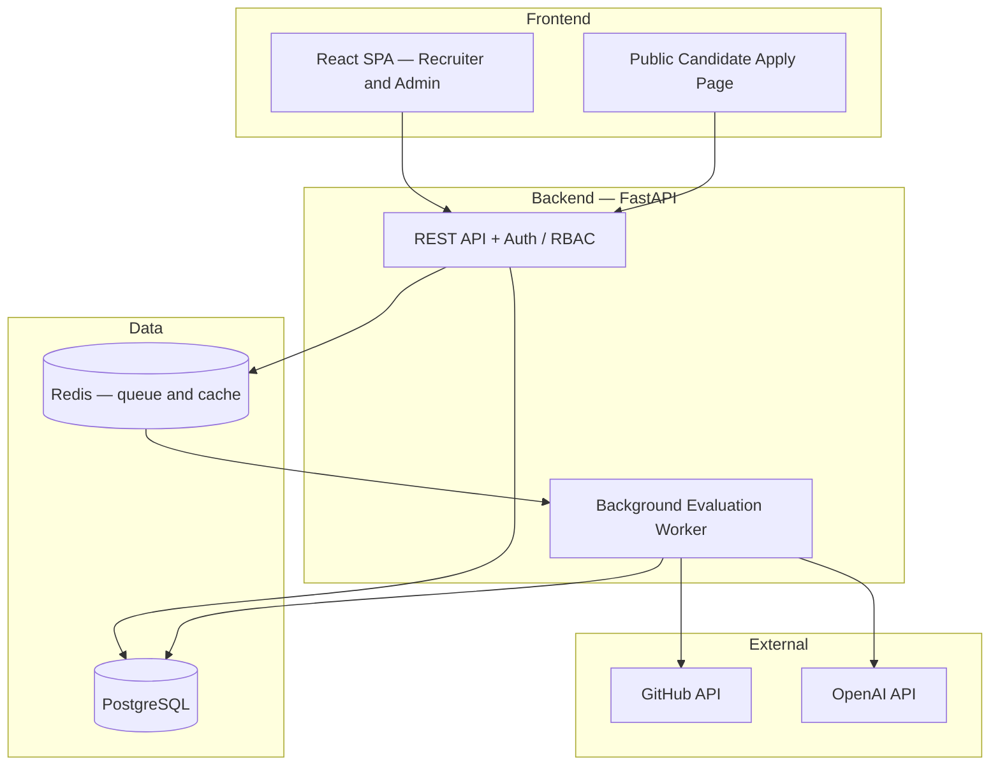
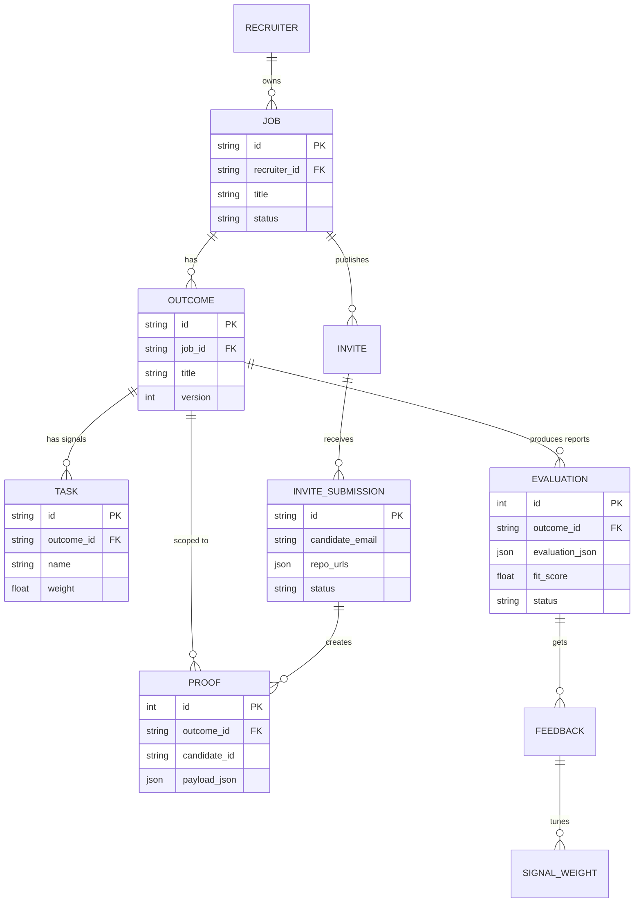

# SignalStack

**Evaluate software candidates on proof of work, not resumes.**

SignalStack turns a job description into measurable outcomes, collects candidate GitHub repositories, analyzes the actual code, and produces an evidence-backed hiring report where every score links back to a real file, commit, or snippet.

> This is a personal full-stack project, built to production-grade engineering standards — real authentication, database migrations, a background job queue, observability, and a fault-tolerant evaluation pipeline. It is a demonstration of how such a system is designed and operated, not a commercial product.

| | |
| --- | --- |
| **Frontend** | React 18 · Vite · Tailwind CSS |
| **Backend** | FastAPI · SQLAlchemy · PostgreSQL · Redis |
| **AI** | OpenAI Responses API (strict structured outputs) |
| **Hosting** | Vercel (web) · Render (API) · Neon (DB) · Redis Cloud |

### Engineering highlights

- **Fault-tolerant evaluation** — a failed LLM call never overwrites a valid report with a zero; failures are quarantined and safely retried.
- **Two-stage scoring** — cheap deterministic screening for everyone, expensive LLM analysis only for top candidates.
- **Background queue** — evaluations run asynchronously in Redis and survive process restarts.
- **Real ops** — Alembic migrations, role-based access control, audit logs, and Prometheus-style metrics.

---

## System Architecture



**How the pieces fit together:**

- The **React SPA** serves recruiters and admins; a separate **public page** lets candidates apply through an invite link with no account.
- The **FastAPI** layer handles auth, REST routes, and enqueues evaluation jobs. It stays stateless — all durable state lives in Postgres and Redis — so instances can restart or scale freely.
- The **background worker** consumes jobs from Redis, calls the GitHub and OpenAI APIs, runs the scoring pipeline, and writes results back to Postgres.
- **Redis** doubles as the job queue and a cache for GitHub responses and LLM outputs, so repeat evaluations of unchanged repos are near-free.

---

## Data Model



**Core idea:** a `JOB` breaks into `OUTCOME`s (capabilities to hire for), each with `TASK`s (verifiable signals). Candidates apply through an `INVITE`, creating an `INVITE_SUBMISSION` and one `PROOF` per outcome. The pipeline reads proofs and writes versioned `EVALUATION` reports. Recruiter `FEEDBACK` tunes `SIGNAL_WEIGHT`s that feed back into future scoring.

---

## How Evaluation Works

The pipeline is deliberately **deterministic-first, LLM-second** to control cost and keep scores explainable:

1. **Screen** every candidate with fast, deterministic checks (tests, CI, Docker, commit history, framework detection). No LLM cost.
2. **Rank** candidates and send only the top *N* to deep analysis.
3. **Select evidence** — candidates can submit up to 3 repos, and each outcome signal is judged against the repo that best proves it.
4. **Assess** with the LLM using strict JSON output and citation checks so scores stay grounded in real code.
5. **Score** across independent dimensions — capability, evidence confidence, production readiness, and authorship — so one weak signal never silently drags down the rest.
6. **Learn** — recruiter decisions adjust signal/task weights (bounded, audited, revertible).

### Reliability: failed evaluations never corrupt good data

The evaluation flow uses a **validated-write / merge-preserve** approach so a temporary outage (e.g. the LLM being unavailable) can't leave bad data behind:

| Guarantee | How |
| --- | --- |
| No fake scores | A failed LLM call returns an explicit failure marker, never a silent `0.0`. |
| All-or-nothing per candidate | Any candidate with a failed step is **quarantined** — kept out of the report entirely for that run. |
| Previous results preserved | Reports are append-only versions; a new one is written only if it contains a real result. A failed run never overwrites the last valid report. |
| Safe, idempotent retries | Quarantined candidates flip back to retryable; re-running re-evaluates only the missing ones. |
| No duplicate work | Enqueueing is idempotent — one pending job per posting; repeated clicks reuse it. |

---

## Tech Stack

| Layer | Choices |
| --- | --- |
| Frontend | React 18, Vite, Tailwind CSS, Recharts, Lucide |
| API | FastAPI, Pydantic v2 (typed schemas, auto OpenAPI docs) |
| Data | PostgreSQL + SQLAlchemy 2, Alembic migrations (SQLite fallback for local dev) |
| Queue / cache | Redis (in-memory fallback for local dev) |
| AI | OpenAI Responses API — strict JSON schema, model routing, retries with backoff, cost tracking |
| Auth | PBKDF2-SHA256 passwords, signed bearer tokens, invite-only signup |
| Observability | JSON + Prometheus metrics (latency, tokens, cost, cache hits) |

## Project Structure

```text
backend/
  app/
    config/     Config and database session
    models/     SQLAlchemy models
    pipeline/   Evaluator, evidence selector, scoring engine, feedback learning
    routes/     FastAPI route handlers
    schemas/    Pydantic request/response schemas
    services/   LLM, GitHub, LeetCode, Redis queue/cache, auth
  alembic/      Database migrations
  tests/        Unit and integration tests
frontend/
  src/
    components/ Shared UI (layout, evidence cards, charts)
    pages/      Route-level views
    index.css   Design tokens and component classes
```

## API Overview

| Area | Endpoints |
| --- | --- |
| Auth | `POST /recruiter/login`, `POST /recruiter/signup`, `GET /recruiter/me` |
| Jobs & outcomes | `POST/GET/PATCH/DELETE /jobs`, `POST/PATCH/DELETE /outcomes/{id}` |
| Candidate intake | `POST /jobs/{id}/invites`, `GET /invites/{token}`, `POST /invites/{token}/submit` |
| Evaluation | `POST /jobs/{id}/evaluations/queue`, `GET /jobs/{id}/evaluations/progress` |
| Learning & admin | `POST /plugin/feedback`, `GET /admin/signal-weights`, `/admin/audit-logs` |
| Ops | `GET /metrics`, `GET /metrics/prometheus` |

Full interactive docs are available at `/docs` when the API is running.

## Getting Started

```bash
# Backend
cd backend
python -m venv .venv && .venv\Scripts\Activate.ps1     # or: source .venv/bin/activate
pip install -r requirements.txt -r requirements-test.txt
cp .env.example .env                                    # fill in your values
alembic upgrade head                                    # existing DB: alembic stamp head
uvicorn app.main:app --port 8000 --reload

# Frontend
cd frontend && npm install && npm run dev
```

App → `http://localhost:5173` · API docs → `http://localhost:8000/docs`

**Try it instantly:** run `python backend/seed_demo_auth.py` to seed a demo recruiter (`demo@signalstack.dev` / `Demo@12345`, also shown on the login page) plus a sample job.

<details>
<summary><strong>Key environment variables</strong></summary>

| Variable | Required | Purpose |
| --- | --- | --- |
| `OPENAI_API_KEY` | Yes | Signal generation and grounded assessment |
| `GITHUB_TOKEN` | Yes | Repository and commit analysis |
| `DATABASE_URL` | Recommended | PostgreSQL (SQLite fallback if unset) |
| `REDIS_URL` | Recommended | Queue + cache (in-memory fallback if unset) |
| `AUTH_SECRET` | Production | Token-signing secret |
| `ADMIN_EMAIL` | Production | Bootstraps the admin account on first login |
| `OPENAI_MODEL` / `OPENAI_EVAL_MODEL` / `OPENAI_FAST_MODEL` | No | Model selection and routing |

See `backend/.env.example` for the full list.

</details>

## Quality Gates

```bash
python -m pytest backend/tests -q          # backend tests
cd frontend && npm run lint && npm run build   # frontend checks
```

## Notes on Scale & Security

- **Cost stays sublinear** — deterministic screening for all, LLM only for top candidates, plus one batched LLM call per candidate × outcome (not per signal).
- **Access control is enforced server-side** — admin / recruiter / candidate roles are checked on every job-scoped route, not just hidden in the UI.
- **Data is isolated** — proofs are scoped by job, outcome, candidate, and submission, so one candidate's evidence can never leak into another's report.
- **No secrets in the repo** — everything sensitive comes from environment variables.

## Future Enhancements

- Move the worker into a dedicated service (Celery / RQ) with a dead-letter queue
- Embedding-based evidence retrieval for large monorepos
- Calibration datasets and prompt versioning for evaluation consistency
- Exportable PDF reports and shareable report links
- Realtime progress via SSE / WebSockets

---

Built as a personal project to explore production-grade full-stack and applied-AI engineering.
